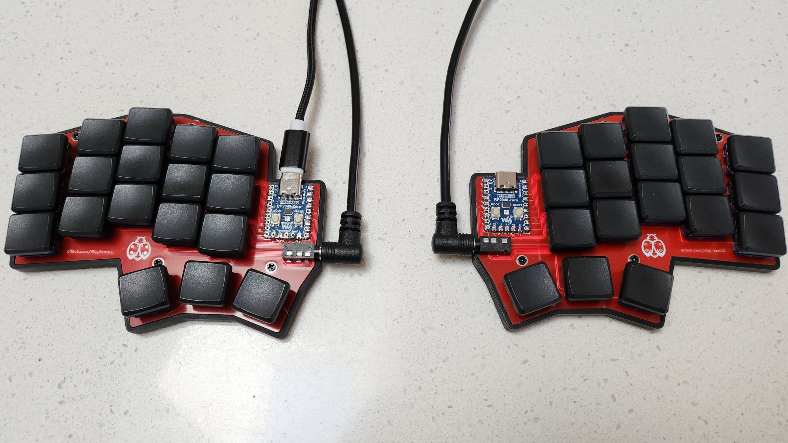
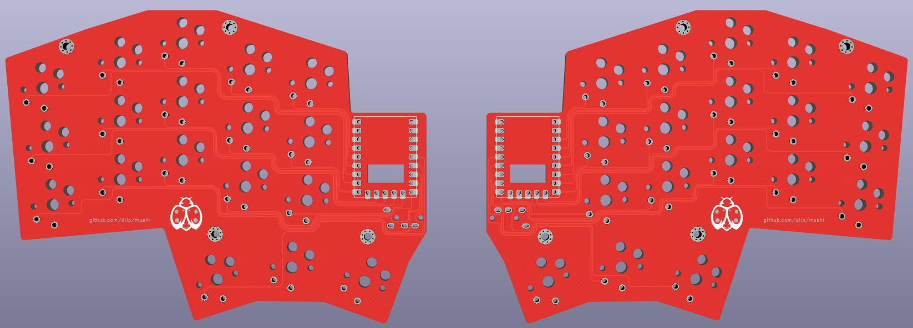

# Mushi Keyboard



Mushi (Japanese for bug) is a simple 36 key split ergonomic Keyboard.

## Features

- Uses 2 cheap RP2040-Zero MCU
- Requires no diodes
- Unique inner thumb splay to make it easier to reach
- Created with [Ergogen](https://github.com/ergogen/ergogen) and [KiCad](https://www.kicad.org)

## Build Your Own

### Board



#### Parts

- Send the [Gerber](kicad/gerber_to_order) file to the PCB manufacturer of your choice
- 2 x RP2040-Zero
- 2 x TRRS socket
- 1 x TRRS cable
- 36 x low profile choc switches and keycaps
- (optional) 36 x kailh hotswap sockets
- (optional) RP2040-Zero headers


#### Firmware

- [QMK](https://github.com/dlip/qmk_firmware/tree/dlip/keyboards/mushi)

#### Instructions

- Solder the RP2040-Zeros to the board either directly or using the headers you purchased
- Build and flash the firmware

Left side

```
qmk flash -kb mushi -km default -bl uf2-split-left
```

Right side

```
qmk flash -kb mushi -km default -bl uf2-split-right
```

- You can test the boards at this point by connecting the hotswap pads with some metal tweezers before continuing
- Solder the kalih hotswap sockets if purchased or solder the switches directly the board otherwise
- Solder the TRRS sockets to the board
- Insert the switches into the hotswap sockets if necessary
- Add your keycaps
- Connect TRRS cable before connecting the usb cable and remember to disconnect it after disconnecting the usb cable
- Create your own keymap by forking my repo and either modifying the default keymap or copying it to a new name and changing 'default' in the flash command

### Case


#### Parts

The screws/nuts are optional, its a pretty tight fit so you might not need them.

- 3D print the left and right cases in the [case](case/) folder
- (optional) 8 x Knurled Insert Nuts (M2 x 3mm Length x 3.2mm OD) [example](https://www.amazon.com/dp/B07LBQFNQD)
- (optional) 8 x M2 3mm flat screws [example](https://www.amazon.com/gp/product/B01FTI8TM8/) 

#### Instructions

- Use a soldering iron to melt the insert nuts into the holes in the cases
- Screw the boards to the cases

### Credits

- alinelena for checking my work and helping me make such beautiful tracks
- logturnal for the cool [bug logo](https://www.freepik.com/free-vector/ladybug-simple-mascot-logo-design-illustration_57161077.htm)